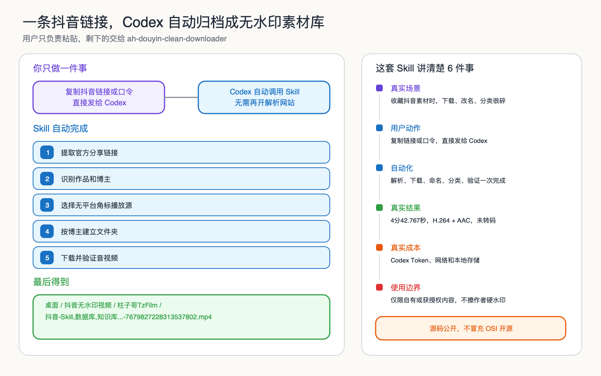

# 阿杭 Skills

阿杭公开的 Codex Skills 集合。

这里不堆提示词，也不把概念 Demo 当成成品。每个 Skill 都来自真实工作流，包含可运行脚本、使用边界、测试和来源说明。

阿杭是产品经理出身的内容创业者。技术是实现手段，目标是把反复发生的动作整理成可以复用、验证和交付的工作流。



## 已公开 Skills

| Skill | 能做什么 | 状态 |
|---|---|---|
| [ah-douyin-clean-downloader](skills/ah-douyin-clean-downloader/) | 把抖音官方链接或分享口令发给 Codex，获取无抖音平台角标的播放源，保留原音视频，并在桌面按博主自动分类 | [v0.1.0](https://github.com/ahang008/ah-skills/releases/tag/ah-douyin-clean-downloader-v0.1.0) |

后续新增 Skill 统一放在 `skills/` 目录，并使用 `ah-` 前缀。

## 安装单个 Skill

```bash
git clone https://github.com/ahang008/ah-skills.git
mkdir -p "${CODEX_HOME:-$HOME/.codex}/skills"
cp -R ah-skills/skills/ah-douyin-clean-downloader "${CODEX_HOME:-$HOME/.codex}/skills/"
```

安装完成后，在 Codex 中直接发送抖音官方链接或完整分享口令即可。

具体环境要求、触发规则和使用边界见对应 Skill 的 README 和 SKILL.md。

## 运行测试

```bash
./scripts/test-all.sh
```

当前版本会依次编译并测试仓库中的每个 Skill。

## 仓库约定

- 每个 Skill 独立放在 `skills/<skill-name>/`。
- 名称统一使用 `ah-` 前缀。
- 每个 Skill 必须包含 `SKILL.md`、README、测试、来源说明和许可证。
- 不提交真实用户数据、视频、Cookie、Token、账号信息或私密链接。
- 未经验证的功能不写进 README。

## 许可

当前仓库采用 [AH Source Available Non-Commercial License 1.0](LICENSE)。

允许个人学习、研究、修改和非商业使用。商业使用、付费产品、课程、客户交付、SaaS 或托管服务需要事先获得书面授权。

这是源码可见许可证，不属于 OSI 认可的开源许可证。不同 Skill 如采用其他许可证，会在其目录中单独说明。

## 使用边界

- 只处理你本人拥有或已经获得授权的内容。
- 不绕过登录、付费、访问控制或平台安全机制。
- 不保证第三方平台接口长期稳定。
- 使用者需要自行遵守平台规则、著作权规则和所在地法律。

## 参与贡献

问题反馈和改进建议请提交 GitHub Issue。提交代码前请阅读 [CONTRIBUTING.md](CONTRIBUTING.md)。
