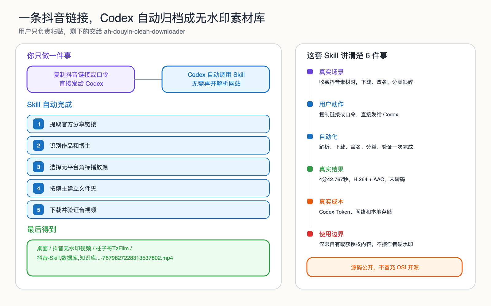

# 阿杭 Skills


阿杭公开的 Codex Skills 集合。


这里不堆提示词，也不把概念 Demo 当成成品。每个 Skill 都来自真实工作流，包含可运行脚本、使用边界、测试和来源说明。


阿杭是产品经理出身的内容创业者。技术是实现手段，目标是把反复发生的动作整理成可以复用、验证和交付的工作流。





## 已公开 Skills


| Skill | 能做什么 | 状态 |
|---|---|---|
| [ah-think](https://github.com/ahang008/ah-think) | 澄清目标与取舍，检查现实条件和反馈，帮助思考并保留自主决定；当前为试用 MVP | [v0.1.2 试用](https://github.com/ahang008/ah-think/releases/tag/v0.1.2) |
| [ah-douyin-clean-downloader](https://github.com/ahang008/ah-douyin-clean-downloader) | 把抖音官方链接或分享口令发给 Codex，获取无抖音平台角标的播放源，保留原音视频，并在桌面按博主自动分类 | [v0.1.0](https://github.com/ahang008/ah-douyin-clean-downloader/releases/tag/v0.1.0) |
| [ah-longform-clip-matrix](https://github.com/ahang008/ah-longform-clip-matrix) | 围绕不同观众问题跨位置重组长口播，生成切片候选、来源时间映射与明确的内容验收状态；[查看架构图](https://github.com/ahang008/ah-longform-clip-matrix/blob/main/assets/长内容切片矩阵Skill架构.png)和[可编辑源文件](https://github.com/ahang008/ah-longform-clip-matrix/blob/main/docs/长内容切片矩阵Skill架构.excalidraw) | 已发布 |


后续新增 Skill 统一使用 `ah-` 前缀，并建立独立 GitHub 仓库。这个仓库只负责品牌目录和索引，方便用户把某一个 Skill 的链接直接交给 Codex 安装。


## 安装单个 Skill


```text
安装这个 Skill：https://github.com/ahang008/ah-douyin-clean-downloader
```


把上面这句话发给 Codex。安装完成后，新开一轮对话，再发送抖音官方链接或完整分享口令即可。


具体环境要求、触发规则和使用边界见对应 Skill 的 README 和 SKILL.md。


## 仓库约定


- 每个 Skill 使用独立 GitHub 仓库，本仓库只保存目录和品牌说明。

合作推广：受众在跨境出海、独立开发、AI视频、模型测评。这些方向的商单可以找我。微信 Zephyr136。X：https://x.com/Astronaut_1216
